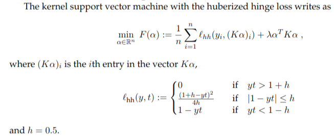
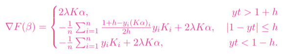
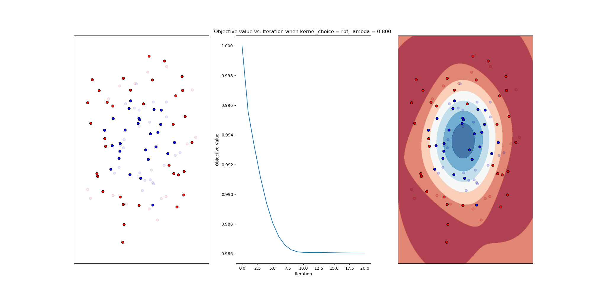
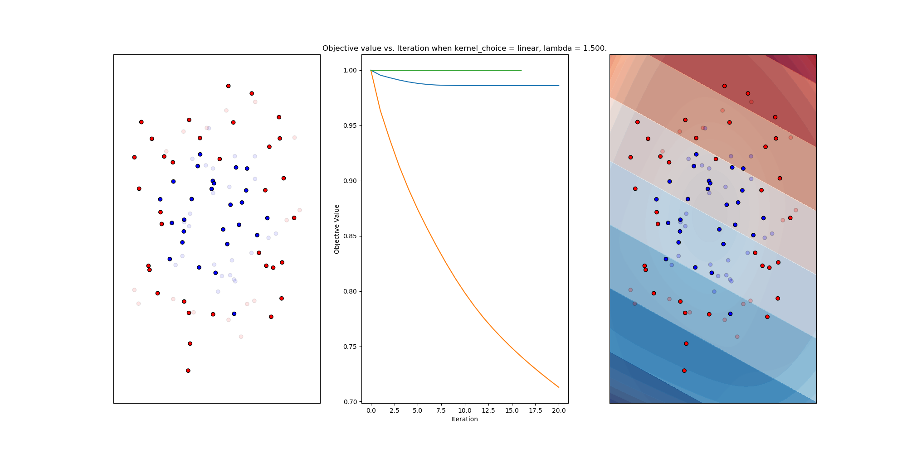
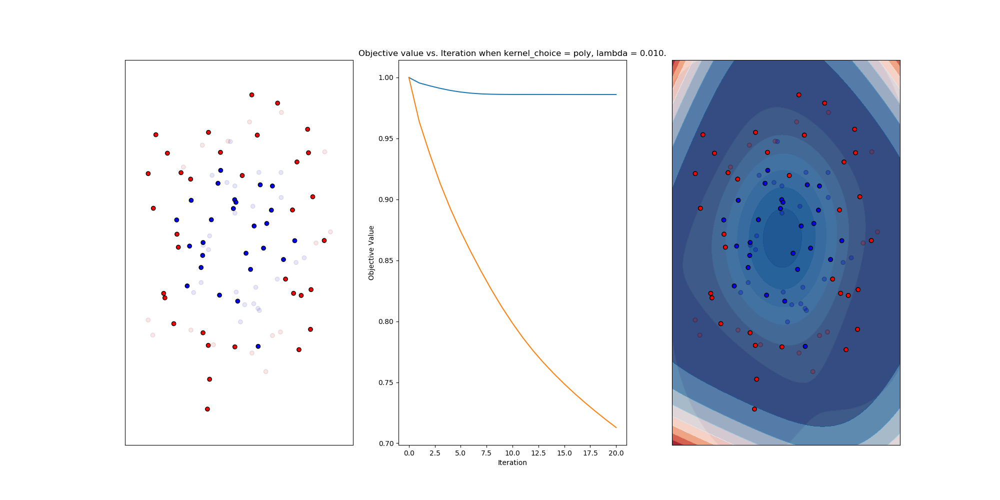
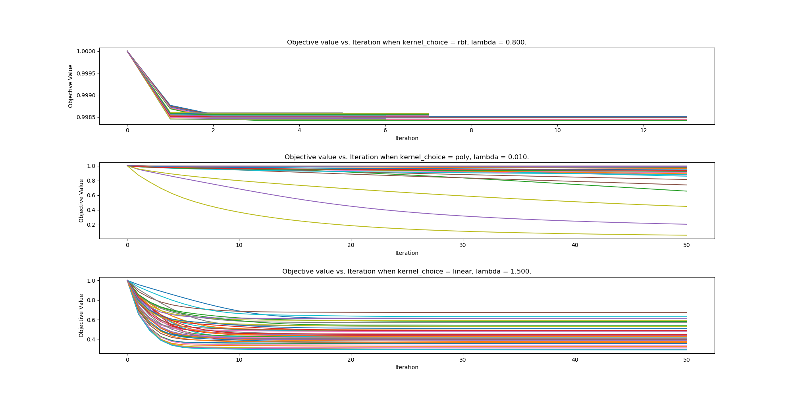
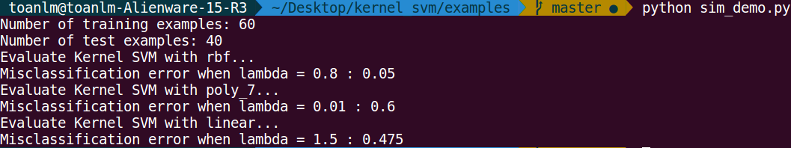
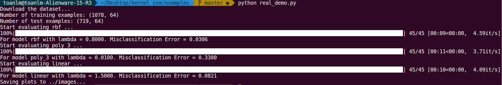
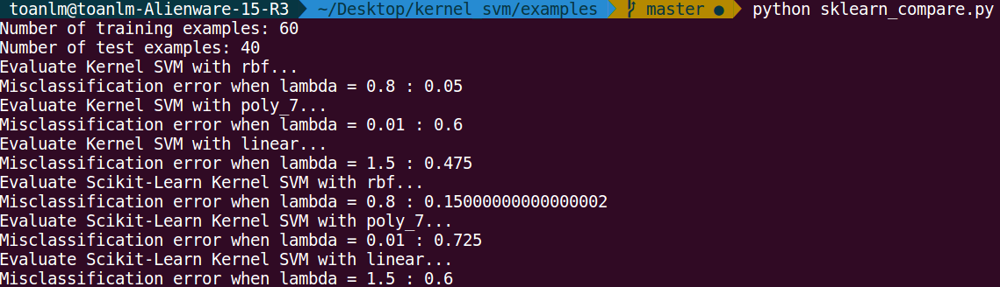

# Kernel SVM

## Usage

For simulated data demo, try:
```
cd examples/
python sim_demo.py
```

For DIGITS data demo, try:
```
cd examples/
python real_demo.py
```
## Dependencies 
Python 3 or 2.7 with the following packages installed:
1. Numpy
2. Scipy
3. Scikit-learn
4. Pandas
5. Matplotlib
6. tqdm

## Background

The loss function is as below:



The gradient is as below:



## Plots









## Screenshots







